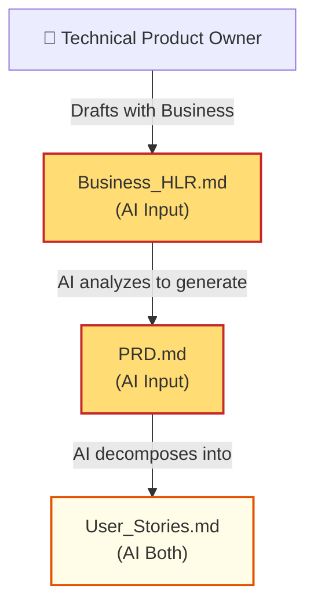
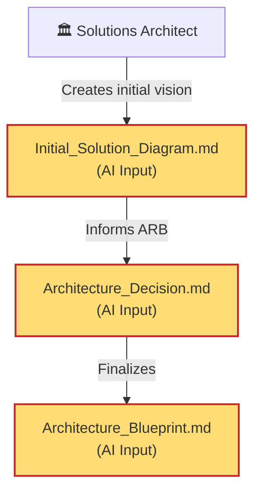
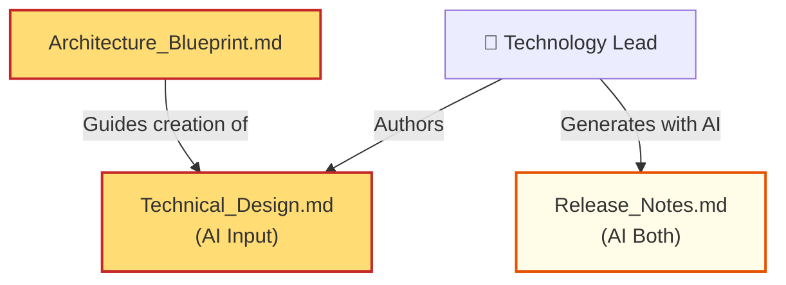
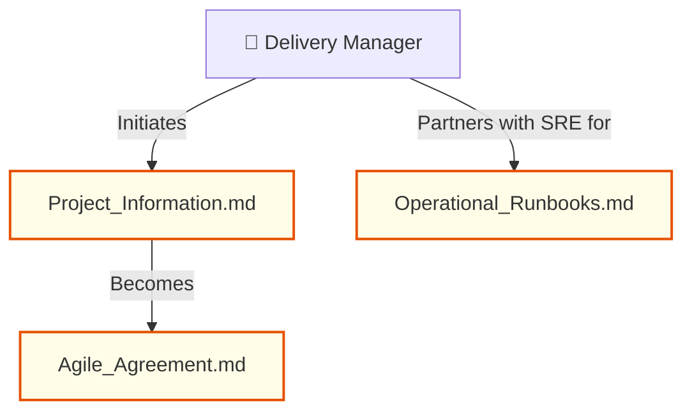
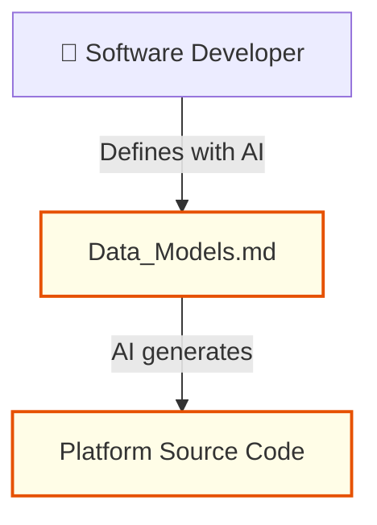
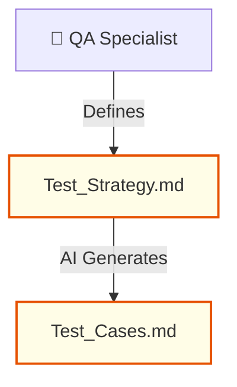

# AI-Native Artifact Guide for Agile Delivery Roles

This guide details the specific markdown (`.md`) artifacts that each role within the RBC Strategic Agile Delivery Framework is responsible for creating and maintaining, in tandem with AI agents like Claude Code. 

Creating these artifacts in structured, plaintext Markdown ensures that AI agents can effortlessly read, understand, and generate downstream deliverables—compounding velocity across the delivery lifecycle.

---

## 1. Technical Product Owner (PO)

The PO is the bridge between business capabilities and technical execution. The PO's artifacts serve as the fundamental "truth" for what needs to be built.

### 📄 `Business_HLR.md` (High Level Requirements)
* **Purpose**: Foundational document defining the core capabilities of the new/enhanced system. It is the highest-level prompt for the entire project.
* **Structure**: 
  * Problem Statement & Business Value
  * In-Scope Capabilities
  * Out-of-Scope Capabilities
  * Key Success Metrics
* **Best Practices**: Use bullet points and highly descriptive language. Avoid technical implementation details; describe *what* needs to happen, not *how*.

### 📄 `PRD.md` (Product Requirements Document)
* **Purpose**: The detailed, downstream translation of the HLR. It provides comprehensive context for AI to ensure functional alignment across the lifecycle.
* **Structure**:
  * Feature Breakdown
  * User Personas
  * Functional Requirements (System must...)
  * Non-Functional Requirements (Performance, Security)
* **Best Practices**: Use clear, normative language (Must, Should, May). Group requirements logically.

### 📄 `User_Stories.md`
* **Purpose**: The functional foundation for actionable development tasks. AI uses this directly to generate tests and implementation code.
* **Structure**: 
  * `As a [Persona], I want [Feature] so that [Benefit]`
  * Acceptance Criteria (Given / When / Then)
* **Best Practices**: Ensure all Acceptance Criteria are rigorously formatted in Gherkin (Given/When/Then) syntax, as this allows AI to instantly generate exact BDD testing code.

---

## 2. Solutions Architect (SA)

The SA determines how the systems technically interact to fulfill the PO's requirements.

### 📄 `Initial_Solution_Diagram.md`
* **Purpose**: Represents the foundational technology landscape. Shows interactions between new systems (blue) and existing systems.
* **Structure**:
  * Embedded Mermaid Context Diagrams (`C4` model preferred)
  * System Identifiers
  * Integration Points (APIs, Events, Batch)
* **Best Practices**: Always embed diagrams natively using mermaid blocks so AI can parse the nodal relationships. Provide a data dictionary for the flows.

### 📄 `Architecture_Blueprint.md`
* **Purpose**: The ARB-approved architectural source of truth. It dictates to AI exactly what the system boundaries, data models, and API contracts must be.
* **Structure**:
  * Component Architecture (Detailed Mermaid Diagrams)
  * Data Flow Definitions
  * Security & Compliance boundaries
* **Best Practices**: Be highly explicit about API payloads and database schemas. If the blueprint is vague, the AI-generated code will hallucinate implementations.

---

## 3. Technology Lead (TL)

The TL translates the Architecture Blueprint into actionable technical designs for the developers and systems.

### 📄 `Technical_Design.md` (TDD)
* **Purpose**: Translates the Blueprint into prompt-ready module definitions, class structures, and function signatures. 
* **Structure**:
  * Sequence Diagrams (Mermaid)
  * Module/Package structure
  * Interface and abstract class definitions
  * Error handling protocols
* **Best Practices**: Treat this markdown file as a massive meta-prompt for an AI developer. Provide exact variable names, expected return types, and constraints.

---

## 4. Delivery Manager (DM)

The DM oversees execution, financial forecasting, and agile governance.

### 📄 `Agile_Agreement.md`
* **Purpose**: The formal contract governing execution, signed midway. 
* **Structure**:
  * Scope boundaries
  * Timeline and Milestones
  * Definition of Done (DoD)
* **Best Practices**: Keep the DoD highly bulleted. AI can ingest the DoD to verify if pull requests and tests actually meet the sign-off criteria.

### 📄 `Operational_Runbooks.md`
* **Purpose**: Step-by-step procedures for production management.
* **Structure**:
  * System alerts
  * Triage steps
  * Remediation scripts
* **Best Practices**: Include explicit bash commands or API calls in markdown code blocks snippet so AI agents can execute automated incident remediations directly from the doc.

---

## 5. Software Developer (Dev)

The Developer executes the code generation, assisted deeply by AI, using the artifacts upstream.

### 📄 `Data_Models.md`
* **Purpose**: Defines information structure, essential for generating automated data access layers.
* **Structure**:
  * Entity-Relationship Diagrams (Mermaid ERD)
  * Field types, constraints, nullability
* **Best Practices**: Use standard markdown tables for schemas or strict Mermaid ER diagrams. AI can instantly map these to SQL schemas or ORM objects.

---

## 6. QA Specialist (QE Lead)

The QA converts user stories and technical designs into automated validation.

### 📄 `Test_Cases.md`
* **Purpose**: The executable logic for verifying the system.
* **Structure**:
  * Scenario Name
  * Preconditions
  * Given/When/Then assertions
* **Best Practices**: Map every Test Case ID back to a User Story ID. AI agents can use this file to auto-generate Jest, Cypress, or Selenium suites.

---

## Core Tenet for AI-Native Delivery

> "If it exists in a Word Doc or PDF, it is invisible to the AI. If it is in structured Markdown with Mermaid diagrams, the AI can read, reason, and build upon it."
