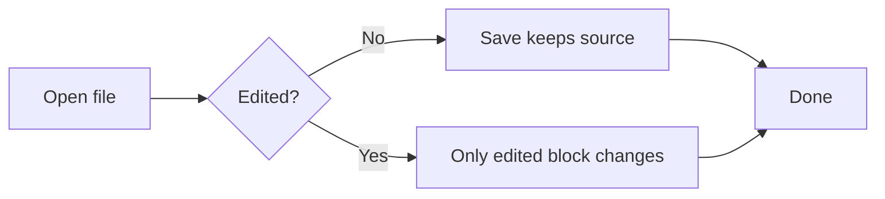
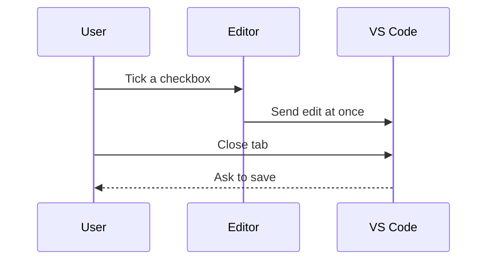
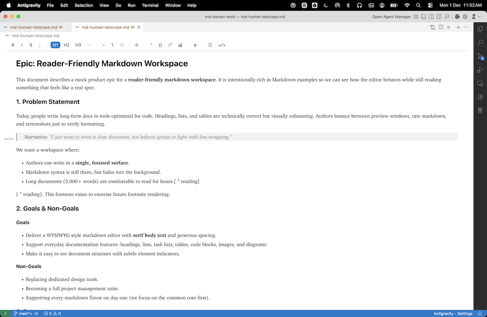
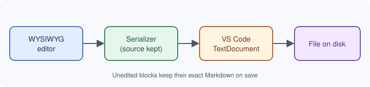

# Markdown for Humans feature tour

This file exercises every major feature in one place. Open it with **Reopen Editor With → Markdown for Humans**, work through the sections, then use the checklist at the end.

> [!TIP]
> Before you start, copy this file somewhere safe or commit it. Several checks compare the saved file against the original.

## 1. Inline formatting

Plain text with **bold**, *italic*, ***bold italic***, ~~strikethrough~~, and `inline code`.
A [regular link](https://code.visualstudio.com), an autolink <https://github.com>, and a link with a title [VS Code docs](https://code.visualstudio.com/docs "Open the docs").
Entities and symbols: &copy; 2026, an em dash &mdash; here, 5 &lt; 10, and an emoji 🚀.
Escaped characters stay literal: \*not italic\*, \_not italic\_, \[not a link\].

This paragraph has soft line breaks.
Each line ends without trailing spaces,
so the saved file should keep these three lines exactly.

This line ends with two spaces for a hard break.  
This line ends with a backslash break.\
And this is the last line of that paragraph.

## 2. Headings

### Third level heading

#### Fourth level heading

##### Fifth level heading

###### Sixth level heading

Setext heading level one
========================

Setext heading level two
------------------------

*Try:* open the **Markdown For Humans: Outline** panel and click a heading to jump to it.

## 3. Quotes and alerts

> A plain blockquote.
> It spans two lines.
>
> > A nested quote inside it.

> [!NOTE]
> Useful information that users should know.

> [!TIP]
> Helpful advice for doing things better.

> [!IMPORTANT]
> Key information users need to know.

> [!WARNING]
> Urgent info that needs immediate attention.

> [!CAUTION]
> Advises about risks or negative outcomes.

## 4. Lists

* Star bullet one
* Star bullet two
  * Nested bullet
    * Third level bullet

- Dash bullet with **bold** text
- Dash bullet with a [link](https://example.com)

1. First ordered item
2. Second ordered item
   1. Nested ordered item
   2. Another nested item
3. Third ordered item

1) Parenthesis style one
2) Parenthesis style two

5. A list that starts at five
6. And continues at six

- Loose list item one

- Loose list item two

### Task list

- [x] Completed task
- [ ] Open task
- [ ] Parent task
  - [x] Nested completed task
  - [ ] Nested open task

*Try:* tick **Open task**, untick it, then save. The file should be byte-identical to the original.

## 5. Tables

| Feature | Status | Owner | Notes |
| :--- | :---: | ---: | --- |
| Save fidelity | ✅ Done | Abhinav | Unedited blocks keep their source |
| **Bold cell** | `code` | 42 | [link](https://example.com) |
| Escaped pipe | a \| b | 7 | |
| Long text | Pending | 1,024 | This cell has a longer sentence to check wrapping in narrow windows |

A compact table, written without padding:

| A | B |
| --- | --- |
| x | yy |

*Try:* edit a cell in the first table only. The compact table below it should stay exactly as written.

## 6. Code blocks

```typescript
interface Release {
  version: string;
  date: Date;
}

const current: Release = { version: "0.4.2", date: new Date("2026-10-04") };
console.log(`Shipping ${current.version}`);
```

```python
def word_count(text: str) -> int:
    """Count words in a Markdown string."""
    return len(text.split())

print(word_count("Write markdown naturally"))
```

```json
{
  "name": "markdown-for-humans",
  "version": "0.4.2",
  "engines": { "vscode": "^1.98.0" }
}
```

```bash
npm ci
npm run build:release
npx vsce package
```

```sql
SELECT title, updated_at
FROM documents
WHERE status = 'draft'
ORDER BY updated_at DESC;
```

```
A fenced block with no language stays plain text.
    Indentation inside is preserved.
```

    An indented code block (four spaces).
    It should round-trip unchanged.

*Try:* hover a code block and click its copy button, then paste somewhere to compare.

## 7. Diagrams





*Try:* double-click a diagram to edit its source.

## 8. Math

Inline math sits in a sentence: $E = mc^2$, and $a^2 + b^2 = c^2$.

$$
\int_0^1 x^2 \, dx = \frac{1}{3}
$$

$$
\sum_{n=1}^{\infty} \frac{1}{n^2} = \frac{\pi^2}{6}
$$

## 9. Images

A PNG screenshot:



A small PNG icon with a title: 

An SVG with no fixed size. It should scale to the reading column:



An SVG sized with HTML:


An image that is also a link:

[](https://github.com/concretios/markdown-for-humans)

*Try:* hover an image for its overlay, drag a corner to resize it, then save and check the Markdown.

## 10. Rules, footnotes and raw HTML

Text above a horizontal rule.

---

Text below it. Footnotes are not rendered yet: the editor shows them as plain text and must save them exactly as written. Here is a reference[^1] and a named one[^note].

<details>
<summary>Raw HTML details block</summary>

Content inside a raw HTML block is preserved as written.

</details>

[^1]: The first footnote.
[^note]: A named footnote.

## 11. Test checklist

Tick each item as you verify it. Ticking also exercises task lists.

- [ ] File opens in the WYSIWYG editor and every section above renders
- [ ] Light and dark themes both look right (switch with **Preferences: Color Theme**)
- [ ] Outline panel lists every heading and click-to-jump works
- [ ] Toolbar tooltips appear when hovering each icon
- [ ] Tick and untick **Open task**, save: no diff
- [ ] Edit one paragraph, save: only that paragraph changes in `git diff`
- [ ] Tick a box and close the tab immediately: VS Code asks to save
- [ ] Edit the file in another editor while it is open: the change appears here
- [ ] Code block copy button copies the exact code
- [ ] Source split view (toolbar) shows Markdown beside the rich view
- [ ] Find (Cmd/Ctrl+F) highlights matches
- [ ] Paste an image from the clipboard: it is saved next to this file and shown
- [ ] Resize an image and save: the size is kept and other lines are unchanged
- [ ] Export to PDF works and the PDF is readable
